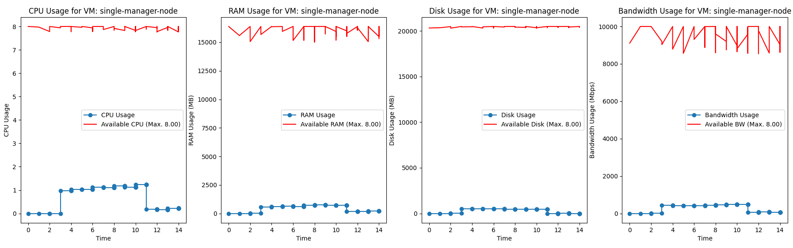

# 🚀 Container Simulation Framework

**Container Simulation Framework** is a **Docker Swarm-like simulation tool** built with **SimPy**. It allows users to **simulate the behavior of Virtual Machines (VMs) and Containers**, track resource utilization, and visualize system performance over time.

## 📖 Overview

This framework enables users to:
- Define **Virtual Machines (VMs)** with limited resources (CPU, RAM, Disk, Bandwidth).
- Deploy multiple **Containers** inside VMs with dynamic workloads.
- Apply **saturation effects** on resource consumption.
- Simulate **workload requests** with different delay, duration, and priority.
- **Monitor** and **visualize** CPU, RAM, Disk, and Bandwidth utilization.

---

## 🔧 **Local Installation**

### 1️⃣ **Clone the Repository**
```bash
git clone https://github.com/milanbalazs/container-simulation.git
cd container-simulation
```

### 2️⃣ **Create a Virtual Environment (with container-simulation)**
```bash
./tools/create_venv.sh
```
> This script creates a **Python virtual environment** (`simulation_venv`), installs the required dependencies, and container-simulation package.

### 3️⃣ **Activate the Virtual Environment**
```bash
source simulation_venv/bin/activate
```

### 4️⃣ **(Optional) Install the Package Locally**
```bash
pip install -e .
```
> This installs the package in **editable mode**, allowing development without reinstallation.

---

## 🚀 **How to Use?**

### 1️⃣ **Run a Simple Simulation**
A **basic simulation** with a **single VM** and **one container** can be executed using (The installed `container-simulation` module is needed):
```bash
python examples/simple.py
```

### 2️⃣ **Run a Multi-Node Simulation**
For a **multi-node environment** with multiple VMs and containers:
```bash
python examples/multi_node.py
```

### 3️⃣ **View Simulation Results**
After running the simulation, you can visualize the resource usage (Please see the example codes):
```python
simulation.datacenter.vms[0].containers[0].visualize_usage()
simulation.datacenter.vms[0].visualize_usage()
simulation.datacenter.visualize_all_vms()
```

---

## 🔍 **Project Structure**
```bash
container-simulation/
│── examples/                # Example scripts for running simulations
│   ├── simple.py            # Single VM & Container simulation
│   ├── multi_node.py        # Multi-VM and multi-container simulation
│
│── src/                     # Core simulation framework
│   ├── simulation.py        # Main simulation logic
│   ├── datacenter.py        # Datacenter managing all VMs
│   ├── vm.py                # Virtual Machine class
│   ├── container.py         # Container class
│   ├── computing_model.py   # Base model for computing resources
│   ├── workload_request.py  # Workload management & task execution
│   ├── utils.py             # Utility functions (e.g., unit conversion)
│   ├── visualizations.py    # Graphs & charts for monitoring
│
│── tools/                   # Utility scripts
│   ├── create_venv.sh       # Automates virtual environment creation
│
│── setup.py                 # Package setup file
│── pyproject.toml           # Modern packaging standard
│── README.md                # Project documentation
```

---

## 🛠 **Key Components**

### 🔹 **1. Virtual Machine (VM)**
- Represents a **host** with limited resources (CPU, RAM, Disk, Bandwidth).
- Hosts **multiple containers** and manages resource allocation.
- **Monitors** resource utilization over time.
- Supports **saturation effects** for realistic fluctuations.

### 🔹 **2. Container**
- Runs inside a VM and **consumes computing resources** dynamically.
- Can receive **workload requests**, increasing resource usage temporarily.
- Tracks **historical usage** of CPU, RAM, Disk, and Bandwidth.

### 🔹 **3. Workload Requests**
- Simulates incoming **tasks** that containers process.
- Each workload request has:
  - **CPU, RAM, Disk, Bandwidth** requirements.
  - **Delay** before execution starts.
  - **Duration** for which it runs.
  - **Saturation percentage** to simulate fluctuating demand.

### 🔹 **4. Simulation Engine**
- Uses **SimPy** to manage event-driven execution.
- Handles **VM startup delays**, **container execution**, and **monitoring**.
- Runs the simulation for a fixed duration and logs resource usage.

### 🔹 **5. Visualization**
- Uses **Matplotlib** to plot **resource usage over time**.
- Tracks and displays:
  - CPU, RAM, Disk, and Bandwidth consumption.
  - Available resources after workload execution.
  - Saturation fluctuations over time.

---

## 📊 **Example Output**
After running a simulation, you will see terminal logs like:

```
[10] VM 'manager-1' Status - Containers: 3, CPU: 2.5/8.0 RAM: 2048/16384 Disk: 4096/20480 BW: 600/10000
[12] Container 'KeyCloak' updated workload: CPU 1.0/2.0 --> 1.5/2.0, RAM 1024/2048 --> 1536/2048
```

And generate **graphs** like:

> 📈 **CPU, RAM, Disk, etc... usage over time**




---

## 🎯 **Contributing**
Want to contribute? Follow these steps:
1. **Fork the repo** and clone it locally.
2. Create a new branch (`git checkout -b feature-branch`).
3. **Make your changes and add docstrings**.
4. Push your changes (`git push origin feature-branch`).
5. Create a **pull request** 🚀.

---

## 💡 **Troubleshooting**
**Q: "ModuleNotFoundError: No module named 'container_simulation'"**
- Ensure you've activated the **virtual environment** (`source simulation_venv/bin/activate`).
- Reinstall the package: `pip install -e .`

**Q: "Cannot create virtual environment"**
- Check if `python3-venv` is installed: `sudo apt install python3-venv`

**Q: "Simulation hangs indefinitely"**
- Ensure you set an appropriate `simulation_time` in your script.

---

## 🏆 **Why Use This?**
✅ **Simulates realistic workloads** in a containerized environment.  
✅ **Tracks real-time resource usage** for better performance tuning.  
✅ **Easy to extend** with new workload types, VMs, and configurations.  
✅ **Comprehensive visualization** to analyze system behavior.  

---

## 📜 **License**
This project is licensed under the **MIT License**.

---

## 🙌 **Acknowledgments**
Special thanks to the **SimPy** and **Matplotlib** communities for their contributions to event-driven simulations and data visualization.

---

🔗 **Author:** _Milan Balazs_  
🔗 **GitHub Repo:** [Container Simulation Framework](https://github.com/milanbalazs/container-simulation)
```
