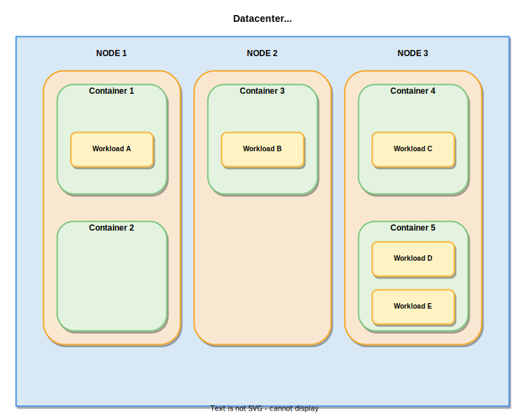
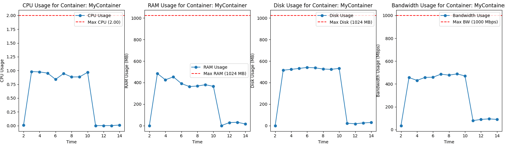
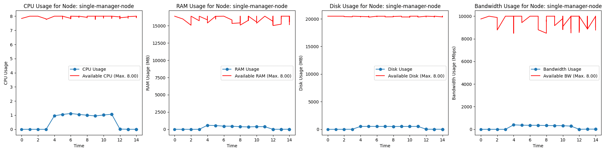

# 🚀 ContSysSim - Python based Containerized System Simulation

**Container Simulation Framework** is a **Docker Swarm-like simulation tool** built with **SimPy**.
It allows users to **simulate the behavior of Nodes and Containers**, track resource utilization,
and visualize system performance over time.

## 📖 Overview

This framework enables users to:
- Define **Nodes** (Physical or Virtual Machines) with limited resources (CPU, RAM, Disk, Bandwidth).
- Deploy multiple **Containers** inside Nodes with dynamic workloads.
- Apply **fluctuation effects** on resource consumption.
  - [Description of fluctuation calculations](docs/fluctuation.md)
- Simulate **workload requests** with different delay, duration, and priority.
- **Monitor** and **visualize** CPU, RAM, Disk, and Bandwidth utilization.
- **Use First-Fit Load Balancing** to allocate workloads efficiently.
- **Enable or disable resource reservations** for smarter workload scheduling.
- **Monitoring and data collection** of an existing containerized system.
  - [Description of container Analyzer tool](src/cont_sys_sim/container_analyzer/README.md)

---

### 🏗️ **High-Level Architecture**

Below is the high-level architecture illustrating the framework's structure and its components:



---

## 🔧 **Local Installation**

### 1️⃣ **Clone the Repository**
```bash
git clone https://github.com/milanbalazs/ContSysSim
cd ContSysSim
```

### 2️⃣ **Create a Virtual Environment (with container-simulation)**
```bash
./tools/create_venv.sh
```
> This script creates a **Python virtual environment** (`simulation_venv`), installs the required dependencies, and container-simulation package.

### 3️⃣ **Activate the Virtual Environment**
```bash
source simulation_venv/bin/activate
```

### 4️⃣ **(Optional) Install the Package Locally**
```bash
pip install -e .
```
> This installs the package in **editable mode**, allowing development without reinstallation.

---

## 🚀 **How to Use?**

### 1️⃣ **Run a Simple Simulation**
A **basic simulation** with a **single Node** and **one container** can be executed using ([simple.py](examples/simple.py)):
```bash
python examples/simple.py
```

### 2️⃣ **Run a Multi-Node Simulation**
For a **multi-node environment** with multiple Nodes and containers ([multi_node.py](examples/multi_node.py)):
```bash
python examples/multi_node.py
```

### 3️⃣ **Configuration-Based Simulation**
The framework also supports running simulations entirely through a **YAML configuration file**.
This allows you to define the entire simulation setup, including Nodes, Containers, Workloads,
and Load Balancer configurations, without modifying the code.

#### **Steps to Run**
1. Create a YAML configuration file. See the [Configuration Guide](./src/cont_sys_sim/cli/README.md) for details and examples.
2. Run the simulation by specifying the configuration file:

```bash
python cli_starter.py --config path/to/config.yml
```

#### **Example Configuration**
Refer to the [Configuration Guide](./src/cont_sys_sim/cli/README.md) for a detailed breakdown of the configuration structure and an example YAML file.

---

### 4️⃣ **Enable or Disable Load Balancer Reservations**
With the **First-Fit with Reservations Load Balancer**, users can **toggle workload reservations** using the `use_reservations` parameter:

#### **✅ First-Fit with Reservations (Default)**
> The scheduler considers workload start time and duration when assigning resources.
```python
simulation = LbSimulation(use_reservations=True)
```

#### **⚡ Classic First-Fit (No Reservations)**
> The scheduler ignores workload timing and places them immediately if resources are available.
```python
simulation = LbSimulation(use_reservations=False)
```

---

## 🛠 **Key Components**

### 🔹 **1. Node (Physical or Virtual machines)**
- Represents a **host** with limited resources (CPU, RAM, Disk, Bandwidth).
- Hosts **multiple containers** and manages resource allocation.
- **Monitors** resource utilization over time.
- Supports **fluctuation effects** for realistic fluctuations.

### 🔹 **2. Container**
- Runs inside a Node and **consumes computing resources** dynamically.
- Can receive **workload requests**, increasing resource usage temporarily.
- Tracks **historical usage** of CPU, RAM, Disk, and Bandwidth.

### 🔹 **3. Workload Requests**
- Simulates incoming **tasks** that containers process.
- Each workload request has:
  - **CPU, RAM, Disk, Bandwidth** requirements.
  - **Delay** before execution starts.
  - **Duration** for which it runs.
  - **fluctuation percentage** to simulate fluctuating demand.

### 🔹 **4. Load Balancer**
- Implements **First-Fit with Reservations Scheduling** for efficient workload placement.
- Uses the `use_reservations` parameter to **toggle between**:
  - **Smart scheduling (default)** → Considers workload start time & duration.
  - **Immediate scheduling** → Places workloads as soon as resources are available.
- Prevents **resource overload** by rejecting excessive workloads.

### 🔹 **5. Simulation Engine**
- Uses **SimPy** to manage event-driven execution.
- Handles **Node startup delays**, **container execution**, and **monitoring**.
- Runs the simulation for a fixed duration and logs resource usage.

### 🔹 **6. Visualization**
- Uses **Matplotlib** to plot **resource usage over time**.
- Tracks and displays:
  - CPU, RAM, Disk, and Bandwidth consumption.
  - Available resources after workload execution.
  - Fluctuations over time.

---

## 📊 **Example Output**
After running a simulation, you will see terminal logs like:

```
[10] Node 'manager-1' Status - Containers: 3, CPU: 2.5/8.0 RAM: 2048/16384 Disk: 4096/20480 BW: 600/10000
[12] Container 'KeyCloak' updated workload: CPU 1.0/2.0 --> 1.5/2.0, RAM 1024/2048 --> 1536/2048
```

And generate **graphs** like:

> 📈 **CPU, RAM, Disk, etc... usage over time**




---

## 🎯 **Contributing**
Want to contribute? Follow these steps:
1. **Fork the repo** and clone it locally.
2. Create a new branch (`git checkout -b feature-branch`).
3. **Make your changes and add docstrings**.
4. Push your changes (`git push origin feature-branch`).
5. Create a **pull request** 🚀.

---

## 💡 **Troubleshooting**
**Q: "ModuleNotFoundError: No module named 'cont_sys_sim'"**
- Ensure you've activated the **virtual environment** (`source simulation_venv/bin/activate`).
- Reinstall the package: `pip install -e .`

**Q: "Simulation hangs indefinitely"**
- Ensure you set an appropriate `simulation_time` in your script.

---

## 📜 **License**
This project is licensed under the **MIT License**.

---

## 🙌 **Acknowledgments**
TODO

---

🔗 **Author:** _Milan Balazs_  
🔗 **GitHub Repo:** [Container Simulation Framework](https://github.com/milanbalazs/ContSysSim)
