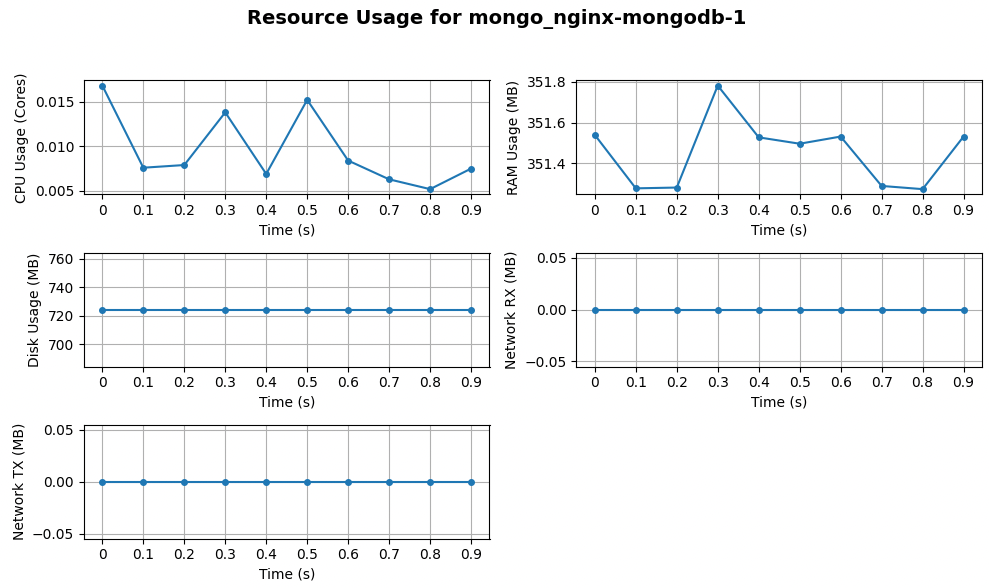

# Containerized System Analyzer

## Overview

The **Containerized System Analyzer** is a Python-based tool for monitoring and analyzing
resource usage in **Docker containers** and **Docker Swarm services**.
It collects real-time data on **CPU**, **RAM**, **Disk**, and **Network usage** over a
specified time window and computes average resource consumption.

This tool is useful for system administrators, DevOps engineers,
and developers who need detailed insights into containerized applications' resource usage.

## Features

- **Monitor CPU, RAM, Disk, and Network usage** for Docker containers and Swarm services.
- **Analyze real-time statistics** and compute average resource consumption.
- **Support for standalone Docker containers** and **Docker Swarm services**.
- **Flexible time window and sampling interval** for monitoring.
- **Save resource usage data to a JSON file** for further analysis.
- **Command-line interface (CLI) support** with customizable parameters.
- **Visualization module** to generate plots for resource consumption trends.

## Resource calculation formulas

The detailed calculation formulas for the resources can be found:

- [Formulas](analyzer_formulas.md)

## Installation

### Prerequisites

- Python 3.11+
- Docker installed and running containers/services

### Setup

Clone the repository and generate Python virtual environment:

```sh
cd <repo_folder>
./tools/create_venv.sh
source simulation_venv/bin/activate
```

## Usage

### Running the Analyzer

The tool can be executed from the command line with different configurations:

#### Monitor all running containers/services

```sh
python analyzer.py --all-entities --time-window 30 --period 0.1 --write-to-file
```
#### Monitor a specific container by ID or Name

```sh
python analyzer.py --container-id 0800b9b5426c
```

```sh
python analyzer.py --container-name my-container
```

#### Monitor a specific Docker Swarm service

```sh
python analyzer.py --container-name my-swarm-service --swarm-mode
```

#### Monitor all running containers/services and visualize them

```sh
python analyzer.py --all-entities --visualize
```

#### Monitor all running containers/services, visualize them and save the data to JSON

```sh
python analyzer.py --all-entities --visualize --write-to-file
```

### CLI Options

| Argument           | Description                                                              |
|--------------------|--------------------------------------------------------------------------|
| `--time-window`    | Total duration (in seconds) for monitoring (default: `20`)               |
| `--period`         | Sampling interval (in seconds) between each measurement (default: `0.1`) |
| `--swarm-mode`     | Enable analysis for Docker Swarm services                                |
| `--all-entities`   | Analyze all running containers or services                               |
| `--container-id`   | ID of a specific container to analyze                                    |
| `--container-name` | Name of a specific container or service to analyze                       |
| `--write-to-file`  | Save collected data to a JSON file                                       |
| `--visualize`      | Enable to visualize the result (default: `False`)                        |

## Output

### JSON Format

If the `--write-to-file` option is enabled, the resource usage statistics are saved in JSON format:

```json
{
    "my-container": {
        "host": "my-hostname",
        "cpu_cores_samples": { "0": 0.0098, "0.1": 0.0156 },
        "ram_usage_samples": { "0": 331.625, "0.1": 332.0898 },
        "disk_usage_samples": { "0": 724.33 },
        "rx_usage_samples": { "0": 0.0 },
        "tx_usage_samples": { "0": 0.0 }
    }
}
```

### Console Output

The tool also prints summary statistics:

```
Mean Values:
my-container:
  - CPU Usage: 0.0098 cores
  - RAM Usage: 331.62 MB
  - Disk Usage: 724.33 MB
  - Network RX: 0.0 MB
  - Network TX: 0.0 MB
```

## Visualization

To analyze trends over time, use the `visualizer.py` module:

```sh
python visualizer.py --json_file path/to/output.json
```

This will generate time-series plots for each resource type (CPU, RAM, Disk, and Network).

**Example:**



## Modules

### `analyzer.py`

- Collects and processes container/service statistics.
- Computes mean resource usage.
- Supports CLI options for configuration.

### `cont_abstract.py`

- Defines an **abstract base class** for analyzing Docker containers and services.
- Implements methods for retrieving statistics and disk usage.

### `container_analyzer.py`

- Concrete implementation for **Docker containers**.
- Retrieves real-time CPU, RAM, Disk, and Network statistics.

### `service_analyzer.py`

- Concrete implementation for **Docker Swarm services**.
- Retrieves real-time statistics for Swarm tasks.

### `visualizer.py`

- Parses the JSON data from `analyzer.py`.
- Generates **time-series plots** for resource usage trends.

## Future Enhancements

- Add **container health monitoring** and alerting.
- Implement **real-time dashboards**.
- Extend support for **Kubernetes pods**.
